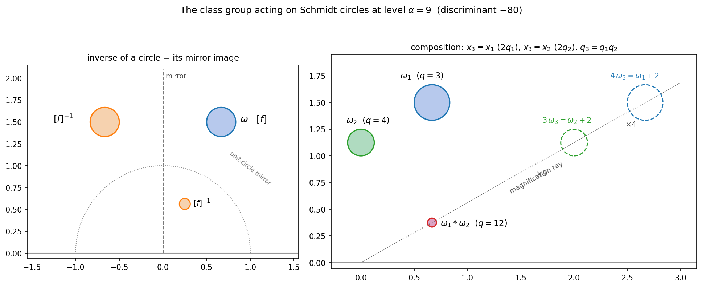

# The class group in circle language: composing and inverting Schmidt circles

Fix a level \(n \ge 2\) and work with the Schmidt circles of invariant \(\alpha = n\): the circles
$$
\omega_{q,x}: \quad \text{radius } \frac{1}{2q}, \quad \text{center } \frac{x + ni}{2q},
\qquad x^2 \equiv 1 - n^2 \pmod{4q},
$$
which correspond bijectively to positive definite forms \(f_\omega = (q, -x, m)\) of discriminant \(D = 1 - n^2\) ([hyperbolic-counting.md](hyperbolic-counting.md) §2). Their \(\mathrm{SL}_2(\mathbb{Z})\)-classes therefore carry the **class group** structure of discriminant \(D\) (restricting, as always, to primitive classes). This document answers, in elementary terms: *what do the group operations — composing two circles, inverting a circle — actually do to the circles?* All recipes are verified against Gauss composition on 1913 ordered pairs of classes across all odd \(n \le 41\) ([scripts/composition_check.py](scripts/composition_check.py)).

## 1. Think of a circle as a fraction

A level-\(n\) circle \(\omega_{q,x}\) is determined by a "denominator" \(q\) (half its curvature) and a "numerator" \(x\) (the horizontal position, in units of \(\tfrac{1}{2q}\)); the height is locked to the level. Two natural moves cost nothing:

- **Sliding.** The translations \(z \mapsto z + 1\) change \(x\) by \(2q\) and stay inside the arrangement; more general elements of \(\Gamma = \mathrm{PSL}_2(\mathbb{Z})\) change \(q\) too. "The class of \(\omega\)" means \(\omega\) up to these moves — like a fraction up to rewriting.
- **Integer magnification divides circles.** The map \(z \mapsto kz\) with \(k \mid q\) sends \(\omega_{q,x}\) to the *smaller-denominator* circle \(\omega_{q/k,\, x/k\ \mathrm{data}}\): radius and center both scale by \(k\), the height stays at level \(n\), and the defining congruence for the new data follows from the old one. (For \(k \nmid q\) the image is not in the arrangement.) So circles at level \(n\) refine and coarsen exactly like fractions with denominator \(q\).

The **identity element** is the class of the *top circle*: \(q = 1\), radius \(\tfrac12\), centered at \(\tfrac{\delta + ni}{2}\) (\(\delta = 0\) for \(n\) odd, \(1\) for \(n\) even) — the largest circles at the level.

## 2. The inverse of a circle: reflect it

> **Recipe (inverse).** The inverse of \(\omega\) is its **mirror image** — reflect in the imaginary axis (or in any vertical line \(\operatorname{Re} z \in \tfrac12\mathbb{Z}\), or invert geometrically in the unit circle): all mirrors of the arrangement give the same class.

In data: the mirror \(z \mapsto -\bar z\) sends \(\omega_{q,x} \mapsto \omega_{q,-x}\), i.e. \(f = (q,-x,m) \mapsto (q, x, m)\), the *opposite* form — the inverse class. Inversion in the unit circle (\(z \mapsto 1/\bar z\)) sends \(\omega_{q,x}\) with co-curvature \(2m\) to \(\omega_{m,x}\) (curvature and co-curvature trade places), again the inverse class. The general principle: **every orientation-reversing symmetry of the Schmidt arrangement inverts every class** (it implements an improper equivalence of forms).

**Corollary (2-torsion = mirror symmetry).** A circle class equals its own inverse **iff** some slide/\(\Gamma\)-translate of the circle has its *hyperbolic center on a mirror line* of the modular tessellation. The three reduced shapes of ambiguous forms match the three basic mirrors:

| reduced form | circle | mirror |
|---|---|---|
| \(b = 0\) | \(x = 0\): hyperbolic center on \(\operatorname{Re} z = 0\) | vertical line |
| \(b = a\) | \(x = q\): hyperbolic center on \(\operatorname{Re} z = \tfrac12\) | half-integer vertical |
| \(a = c\) | \(q = m\): hyperbolic center on \(|z| = 1\) | unit semicircle |

(For \(q = m\): \(|z_{\mathrm{hyp}}|^2 = \tfrac{x^2 + n^2 - 1}{4q^2} = \tfrac{4qm}{4q^2} = \tfrac mq\).) This makes the all-edge phenomenon of [hyperbolic-counting.md](hyperbolic-counting.md) transparent: at \(n = 3, 5\) *every* class is ambiguous (the class groups are \((\mathbb{Z}/2)^k\)), so every circle in the ideal triangle sits on a mirror — and the triangle's edges are mirrors.

## 3. The composition of two circles: match them under magnification

> **Recipe (composition).** To compose \(\omega_1 = \omega_{q_1, x_1}\) and \(\omega_2 = \omega_{q_2,x_2}\) at the same level \(n\):
> 1. **Slide** the circles within their classes until the half-curvatures \(q_1, q_2\) are **coprime** (always possible — see §4 for which \(q\) occur in a class).
> 2. The composition is the unique level-\(n\) circle with half-curvature \(q_1 q_2\) whose numerator satisfies
> $$ x_3 \equiv x_1 \pmod{2q_1}, \qquad x_3 \equiv x_2 \pmod{2q_2} . $$
> Equivalently, geometrically: \(\omega_1 * \omega_2\) is the unique arrangement circle of curvature \(2q_1q_2\) that **magnifies onto its factors**: \(q_2 \cdot (\omega_1 * \omega_2)\) is a translate of \(\omega_1\), and \(q_1 \cdot (\omega_1 * \omega_2)\) is a translate of \(\omega_2\).

Existence and uniqueness are CRT: the two moduli have gcd \(2\) and \(x_1 \equiv x_2 \pmod 2\) (both determined by the parity of \(n\)), so \(x_3\) exists and is unique mod \(2q_1q_2\) — one circle per unit strip. The defining congruence \(x_3^2 \equiv 1 - n^2 \pmod{4q_1q_2}\) is automatic from the two factors. The equivalence of the two formulations is one line: \(x_3 \equiv x_1 \pmod {2q_1}\) says precisely that the \(q_2\)-fold magnification of \(\omega_3\) (radius \(\tfrac{1}{2q_1}\), center \(\tfrac{x_3 + ni}{2q_1}\)) differs from \(\omega_1\) by the integer translation \(\tfrac{x_3 - x_1}{2q_1}\). Note the three centers involved in each magnification lie on a ray through the origin (see the figure).

**Worked examples at level \(n = 9\)** (\(D = -80\), class group \(\cong \mathbb{Z}/4\) with classes \((1,0,20), (3,\pm2,7), (4,0,5)\)):

- \(\omega_{3,4} * \omega_{4,0}\): CRT gives \(x_3 \equiv 4\ (6)\), \(\equiv 0\ (8)\): \(x_3 = 16\), so the composite is \(\omega_{12,16}\) — radius \(\tfrac1{24}\), center \(\tfrac{16+9i}{24}\). Check: \(4\,\omega_{12,16}\) has center \(\tfrac{16+9i}{6} = \) center of \(\omega_{3,4}\) plus \(2\). In classes: \([(3,2,7)] \cdot [(4,0,5)] = [(3,-2,7)]\) ✓.
- Squaring \(\omega_{3,4}\) (class \((3,2,7)\), a generator): the factors share \(q = 3\), so first slide one copy: the form \((3,2,7)\) also represents \(7\), giving the equivalent circle \(\omega_{7,2}\). Then \(x_3 \equiv 4\ (6)\), \(\equiv 2\ (14)\): \(x_3 = 16\), composite \(\omega_{21,16}\), whose form \((21,-16,4)\) reduces to \((4,0,5)\) — the order-2 class, as it must be for the generator of \(\mathbb{Z}/4\) ✓.

**Why this is Gauss composition.** In ideal language ([class-formula-proof.md](class-formula-proof.md) §0) the circle \(\omega_{q,x}\) corresponds to \(\mathfrak{a} = \mathbb{Z}q + \mathbb{Z}\theta\), \(\theta = \tfrac{-x + \sqrt D}{2}\). For coprime \(q_1, q_2\) and the CRT numerator \(x_3\), the element \(\theta_3 = \tfrac{-x_3+\sqrt D}{2}\) is congruent to the respective \(\theta_k\) mod \(q_k\), and
$$
(q_1, \theta_3)(q_2, \theta_3) = \bigl(q_1q_2,\; q_1\theta_3,\; q_2\theta_3,\; \theta_3^2\bigr) = (q_1q_2, \theta_3),
$$
since \(\gcd(q_1,q_2) = 1\) puts \(\theta_3\) in the ideal and \(\theta_3^2 = -x_3\theta_3 - N(\theta_3)\) with \(q_1q_2 \mid N(\theta_3)\). So the recipe *is* multiplication of ideals — equivalently Dirichlet composition of the concordant forms \((q_1, -x_3, q_2m_3)\) and \((q_2, -x_3, q_1m_3)\).

## 4. The dictionary, assembled

The connections between the Schmidt arrangement and the class group of \(\mathbb{Q}(\sqrt{1-n^2})\) now form a closed circle of ideas:

1. **Points.** The hyperbolic center of a level-\(n\) circle is literally an element of \(K = \mathbb{Q}(\sqrt{1-n^2}) \subset \mathbb{C}\) — a CM point of discriminant \(1-n^2\); the circle is the CM point thickened to hyperbolic radius \(\operatorname{arcoth} n\).
2. **Group law.** Composition = ideal multiplication = the CRT/magnification recipe of §3; inverse = ideal conjugation = mirror reflection; identity = the top circle. The primitive classes at level \(n\) form a group \(\cong \mathrm{Cl}(1-n^2)\); composition is defined only *within* a level, just as Gauss composition needs equal discriminants.
3. **Curvature spectrum = represented numbers.** The half-curvatures of the circles in the \(\Gamma\)-class of \(\omega\) are exactly the integers primitively represented by \(f_\omega\). ("Which curvatures can this circle be slid to" is the representation problem; in particular genus theory sorts the circles of a level by congruences on their curvature sets — this is what makes step 1 of the composition recipe possible.)
4. **Counting.** Summing \(1\) over classes with automorphism weights counts circles in the ideal triangle: \(3H(n^2-1)\) ([hyperbolic-counting.md](hyperbolic-counting.md)); ambiguous classes are visible as mirror-centered circles (§2).
5. **The involution.** The Galois-type involution \(\sigma(X) = \bar X^{-1}\) acts on classes as \(\hat\sigma[f] = [\mathfrak{r}_n][f]^{-1}\) ([involution.md](involution.md), proved in [class-formula-proof.md](class-formula-proof.md)). In the elementary language of this document: **reflect the circle in the imaginary axis, then compose with the circle tangent to the unit circle at \(i\)** — the twist class \(\mathfrak{r}_n\) is represented by \(\omega_{(n-1)/2,\,0}\) (center \(\tfrac{ni}{n-1}\), radius \(\tfrac{1}{n-1}\), externally tangent to \(|z|=1\) at \(i\)) and equally by its partner \(\omega_{(n+1)/2,\,0}\) (internally tangent at \(i\)).

## 5. Matrix-level composition: what the matrices \(X, Y\) buy you

Suppose the circles are handed to us as \(X(\hat{\mathbb{R}})\), \(Y(\hat{\mathbb{R}})\) with \(X, Y \in \mathrm{SL}_2(\mathbb{Z}[i])\) known. Three facts, all machine-verified in [scripts/matrix_composition_check.py](scripts/matrix_composition_check.py):

**(a) A plain matrix product does not compose.** The circle of \(XY\) is \(X(\omega_Y)\) — the *Möbius transport* of \(Y\)'s circle by \(X\) — which generally lands at a completely different level \(\alpha\), and its class is not determined by the two circles: inserting a middle representative (\(XY \to X\gamma Y\), \(\gamma \in \Gamma\), which changes neither circle) changes the answer. (Example at level \(9\): \(XY\) and \(XSY\) give circles at levels \(95\) and \(85\) in unrelated classes.) This is not an accident of the formula: composition is only defined on classes, and *some* alignment of representatives — Gauss's concordance — is unavoidable. What a product of the fun-fact matrices computes instead is geometry of the pair: with \(Z_X = X\bar X^{-1}\),
$$
\operatorname{tr}\bigl(Z_X Z_Y^{-1}\bigr) = 2n^2 + 2x_1x_2 - 4(q_1m_2 + q_2m_1),
$$
a \(\Gamma\)-invariant of the two circles measuring relative position (it equals \(2\) iff the circles coincide) — \(Z_XZ_Y^{-1}\) is the composite of the two circle-inversions, an isometry of \(\mathbb{H}^3\) whose type encodes how the circles sit with respect to each other.

**(b) But the fun-fact matrix hands you the form with no work.** For \(X\) oriented so that \(\operatorname{tr} Z_X = -2n\),
$$
W_X \;:=\; \tfrac{i}{2}\bigl(Z_X + nI\bigr) \;=\; \begin{pmatrix} -x/2 & m \\ -q & x/2 \end{pmatrix}
$$
is an *integral* matrix whose entries are literally the circle data: curvature \(2q\), numerator \(x\), co-curvature \(2m\), form \(f_X = (q, -x, m)\) — no centers, radii, or Bézout completions needed. (This sharpens the fun fact \(X \bar X^{-1} = -iJ\overline{M_X}\): the Cartan image is an affine shift of the quadratic form itself; \(W_X\) is the \(\omega\)-multiplication operator of [class-formula-proof.md](class-formula-proof.md) §5, since \(Z + Z^{-1} = (\operatorname{tr}Z) I\) turns \(\tfrac i4(Z - Z^{-1})\) into \(\tfrac i2(Z + nI)\).) Slides act by conjugation: \(Z_{T^kX} = T^k Z_X T^{-k}\).

**(c) Composition = align, then conjugate by a magnification.** Assume \(\gcd(q_X, q_Y) = 1\) (else re-choose one matrix within its class, §3 step 1). Slide both matrices, \(X \mapsto T^{k_X}X\), \(Y \mapsto T^{k_Y}Y\), so that the two numerators become equal to the CRT value \(x_3\) — the *concordant position*, in which the two centers are collinear with \(0\). Then with \(E_k = \operatorname{diag}(k, 1)\) (the magnification \(z \mapsto kz\)):
$$
W_3 \;=\; E_{q_Y}^{-1}\, W_X\, E_{q_Y} \;=\; E_{q_X}^{-1}\, W_Y\, E_{q_X}
$$
— the two conjugates are **equal as matrices**, integral, and read off the composed circle \((q_Xq_Y,\, x_3)\) directly. (Divisibility is exactly the CRT congruence; equality of the two sides is the matrix form of "\(\omega_3\) magnifies onto both factors".) An explicit \(X_3 \in \mathrm{SL}_2(\mathbb{Z}[i])\) with this circle is then given in closed form by Lemma A of [class-formula-proof.md](class-formula-proof.md).

So the honest answer to "is there a simpler way given \(X\) and \(Y\)": the matrices make the *translation into forms* trivial — one affine expression in \(X\bar X^{-1}\) — and make composition a conjugation; but no universal product formula in raw \((X, Y)\) can exist, because the answer must be blind to representative choices that a product is not.

## 6. Verification

[scripts/composition_check.py](scripts/composition_check.py) checks, for every ordered pair of primitive classes at every odd \(n \le 41\) (1913 pairs):

- the mirror circle \((q,-x)\) and the unit-circle-inversion image \((m, x)\) both land in the inverse class;
- a class is 2-torsion iff its reduced form has the mirror shape (\(b = 0\), \(b = a\), or \(a = c\));
- the CRT/magnification composite of §3 (after an automated slide-to-coprime-curvature) reduces to the Gauss composition of the two classes.

The figure above ([scripts/make_composition_figure.py](scripts/make_composition_figure.py)) shows both recipes at level \(n = 9\).

[scripts/matrix_composition_check.py](scripts/matrix_composition_check.py) verifies §5: the \(W_X = \tfrac i2(Z_X + nI)\) read-off (93 matrices, including slid representatives), the aligned diag-conjugation composition (245 ordered pairs of classes, both conjugates equal as matrices and reducing to the Gauss composite), the failure of naive products to be class-well-defined, and the trace-pairing identity.
