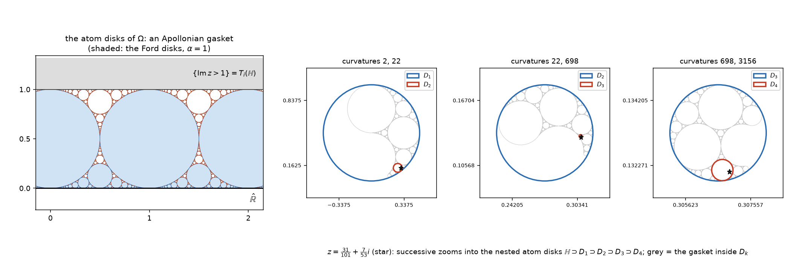

# The monoid of half-plane preserving Gaussian matrices: atoms, unique factorisation, and the Apollonian gasket

Let \(\mathbb{H} = \{z : \operatorname{Im} z > 0\}\) be the upper half plane, \(\hat{\mathbb{R}} = \partial \mathbb{H}\), and let \(\mathrm{SL}_2(\mathbb{Z}[i])\) act on \(\hat{\mathbb{C}}\) by Möbius transformations as in [circle-classification.md](circle-classification.md). This note studies

$$
\boxed{\;\Omega \;=\; \bigl\{\, X \in \mathrm{SL}_2(\mathbb{Z}[i]) \;:\; X(\mathbb{H}) \subseteq \mathbb{H} \,\bigr\}\;}
$$

— the elements of the Bianchi group that push the upper half plane *into itself*. Everything below is proved and machine-verified in exact arithmetic ([scripts/omega.py](scripts/omega.py), [scripts/omega_verify.py](scripts/omega_verify.py): 41/41 checks pass).

## 0. Summary

| | |
|---|---|
| **Membership** | \(X = \begin{pmatrix} a&b\\c&d\end{pmatrix} \in \Omega \iff \operatorname{Im}(c\bar d) \le 0,\ \operatorname{Im}(a\bar b) \le 0,\ \operatorname{Re}(a \bar d - b\bar c) \ge 1\)  (Prop. 1) |
| **Units** | \(\Omega^{\times} = \Omega \cap \Omega^{-1} = \mathrm{SL}_2(\mathbb{Z})\)  (Prop. 3) |
| **Structure** | \(X \mapsto X(\mathbb{H})\) is a bijection \(\Omega/\mathrm{SL}_2(\mathbb{Z}) \to \mathcal{D}\), the set of Schmidt disks inside \(\mathbb{H}\); left divisibility = reverse inclusion (Lemma 4) |
| **Laminarity** | any two circles of the Gaussian Schmidt arrangement are equal, tangent, or disjoint — never crossing — because their inversive product is an *odd integer* (Prop. 5) |
| **Atomicity** | every non-unit of \(\Omega\) is a finite product of atoms, with an explicit bound on the number of factors (Thm. 7) |
| **Uniqueness** | the factorisation is unique up to associates, and \(\ell(XY) = \ell(X) + \ell(Y)\): \(\Omega\) is a *rigid* (unique-factorisation) monoid (Thm. 8) |
| **The atoms** | \(X\) is an atom \(\iff\) \(X(\mathbb{H})\) is a disk of the Apollonian gasket generated by \(\operatorname{Im}z = 0\), \(\operatorname{Im}z = 1\) and the circles \(|z - (k+\tfrac i2)| = \tfrac12\) (Thm. 9) |
| **Invariant** | atoms are classified up to associates by \(\bigl(\alpha, [f]\bigr)\), \(\alpha = \tfrac12\operatorname{tr}(X\bar X^{-1})\) and \(f\) a form of discriminant \(1-\alpha^2\); \(\alpha = 1\) is exactly the class of \(T_i: z \mapsto z+i\) (§7) |
| **Symmetry** | the involution \(\sigma(X) = \bar X^{-1}\) of [involution.md](involution.md) satisfies \(\sigma(\Omega) = \Omega\): it is an anti-automorphism of \(\Omega\), preserving \(\alpha\) and the length \(\ell\) (Prop. 10) |
| **Algorithms** | given \(z \in \mathbb{H}\), find the atom \(X\) with \(z \in X(\mathbb{H})\) and iterate: nested disks \(D_1 \supset D_2 \supset \cdots \ni z\) (§9) |



## 1. Disks as Hermitian matrices

We use the conventions of [circle-classification.md](circle-classification.md). A Hermitian matrix
\(M = \begin{pmatrix} A & B \\ \bar B & C\end{pmatrix}\) (\(A,C \in \mathbb{R}\), \(B \in \mathbb{C}\), \(\det M = AC - |B|^2 = -1\)) determines the **open generalised disk**

$$
\mathcal{D}(M) \;=\; \bigl\{ z : (\bar z, 1) M (z,1)^{\mathsf T} > 0\bigr\}
\;=\;\bigl\{z: A|z|^2 + 2\operatorname{Re}(\bar B z) + C > 0\bigr\},
$$

which for \(A < 0\) is the disk of centre \(-B/A\) and radius \(1/|A|\), for \(A>0\) the *exterior* of that disk, and for \(A = 0\) a half plane. Thus \(M\) encodes an **oriented** circle, and \(M \mapsto -M\) swaps the two sides. The upper half plane is \(\mathcal{D}(M_0)\), \(M_0 = \begin{pmatrix} 0&i\\-i&0\end{pmatrix}\).

For \(X = \begin{pmatrix} a&b\\c&d\end{pmatrix} \in \mathrm{SL}_2(\mathbb{Z}[i])\), the disk \(X(\mathbb{H})\) has matrix

$$
M_X \;=\; (X^{-1})^{\dagger} M_0 X^{-1} \;=\;
\begin{pmatrix} A & B \\ \bar B & C\end{pmatrix},
\qquad
\begin{aligned}
A &= 2\operatorname{Im}(c \bar d), \\
B &= i(a\bar d - b \bar c), \\
C &= 2\operatorname{Im}(a\bar b),
\end{aligned}
$$

and \(A, C\) are even integers, \(B \in \mathbb{Z}[i]\) with \(B \equiv i \pmod 2\). We write throughout

$$
n = -\tfrac{A}{2}, \qquad \zeta = B = x + iy, \qquad m = -\tfrac{C}{2}, \qquad \alpha = y = \operatorname{Im} B,
$$

so that for \(n \ge 1\) the disk is \(|z - \tfrac{\zeta}{2n}| < \tfrac{1}{2n}\), and \(x^2+y^2 = 4nm+1\). By the classification theorem of [circle-classification.md](circle-classification.md), a circle belongs to the Schmidt arrangement \(\mathcal{S}\) iff its data satisfies \(x\) even, \(y\) odd, \(x^2+y^2 \equiv 1 \pmod{4n}\); the lines of \(\mathcal{S}\) are \(\operatorname{Im}z = k\), \(k \in \mathbb{Z}\).

Two normalisations are used constantly:

$$
\langle M, M'\rangle \;=\; \operatorname{Re}(B\bar B') - \tfrac12\bigl(AC' + A'C\bigr)
\;=\; xx' + yy' - 2(nm' + n'm),
$$

the (negated) **inversive product**: writing \(z_j, r_j\) for centres and radii,
\(\langle M,M'\rangle = \bigl(r^2 + r'^2 - |z-z'|^2\bigr)/(2rr')\). Hence

$$
\mathcal{D}(M) \subseteq \mathcal{D}(M') \text{ or } \mathcal{D}(M') \subseteq \mathcal{D}(M)
\iff \langle M,M'\rangle \ge 1, \qquad
\text{internal tangency} \iff \langle M,M'\rangle = 1 ,
$$

while \(\langle M,M'\rangle \le -1\) means the two disks have disjoint interiors (\(=-1\): external tangency) and \(|\langle M,M'\rangle| < 1\) means the two circles cross. In particular

$$
\langle M_0, M_X\rangle = \operatorname{Im}B = \alpha(X).
$$

**The Cartan picture.** By [involution.md](involution.md), \(X\bar X^{-1} = \begin{pmatrix} -iB & -iC\\ iA & i\bar B\end{pmatrix}\), so \(\alpha(X) = \tfrac12 \operatorname{tr}\bigl(X \bar X^{-1}\bigr) = \tfrac12\operatorname{tr}(X\sigma(X))\) for the involution \(\sigma(X) = \bar X^{-1}\), and \((A,B,C)\) *is* the Cartan image of \(X\). The three inequalities of Proposition 1 are therefore three inequalities on the entries of \(X\sigma(X)\): \(\Omega\) is cut out of \(\mathrm{SL}_2(\mathbb{Z}[i])\) by conditions on the Cartan embedding alone.

## 2. Membership in \(\Omega\)

> **Proposition 1.** For \(X \in \mathrm{SL}_2(\mathbb{Z}[i])\) with \(M_X = (A,B,C)\),
> $$
> X \in \Omega \iff A \le 0,\quad C \le 0,\quad \operatorname{Im}B \ge 1,
> $$
> i.e. \(\operatorname{Im}(c\bar d) \le 0\), \(\operatorname{Im}(a \bar b) \le 0\) and \(\operatorname{Re}(a\bar d - b \bar c) \ge 1\). When \(A < 0\) the condition \(C \le 0\) is automatic.

*Proof.* \(X(\mathbb{H}) = \mathcal{D}(M_X)\) and \(\det M_X = -1\).

*Case \(A > 0\).* \(\mathcal{D}(M_X)\) is the exterior of a disk, hence contains points of arbitrarily large modulus, in particular points with \(\operatorname{Im} z<0\): not contained in \(\mathbb{H}\).

*Case \(A<0\).* \(\mathcal{D}(M_X)\) is the disk of centre \(z_0 = -B/A\) and radius \(r = 1/|A|\); it lies in \(\mathbb{H}\) iff \(\operatorname{Im}z_0 \ge r\), i.e. \(\operatorname{Im}B/|A| \ge 1/|A|\), i.e. \(\operatorname{Im}B \ge 1\). If this holds then \(|B| \ge 1\) and \(C = (|B|^2-1)/A \le 0\).

*Case \(A = 0\).* Then \(|B|^2 = 1\), and \(\mathcal{D}(M_X)\) is the half plane on one side of the line \(2\operatorname{Re}(\bar Bz) + C = 0\). A half plane lies in \(\mathbb{H}\) only if its boundary line is horizontal and it is the upper side; with \(|B| = 1\) this forces \(B = \pm i\), and \(B = -i\) gives \(\{\operatorname{Im}z < C/2\}\), which is not contained in \(\mathbb{H}\). So \(B = i\) (equivalently \(\operatorname{Im}B \ge 1\)), the region is \(\{\operatorname{Im}z > -C/2\}\), and it lies in \(\mathbb{H}\) iff \(C \le 0\). \(\square\)

Since \(B = i(a\bar d - b\bar c)\), the condition \(\operatorname{Im}B \ge 1\) reads \(\operatorname{Re}(a\bar d - b\bar c) \ge 1\); note \(\operatorname{Re}(a\bar d - b \bar c) \equiv \operatorname{Re}(ad-bc) = 1 \pmod 2\), so \(\operatorname{Re}(a\bar d-b\bar c)\) is *always* an odd integer and the condition is that it be positive — a shadow of Proposition 5 below.

> **Corollary 2.** \(\alpha(X) \ge 1\) for every \(X \in \Omega\), and the generalised disks arising as \(X(\mathbb{H})\), \(X \in \Omega\), are exactly
> $$
> \mathcal{D} \;=\; \{\,D : D \text{ an open generalised disk},\ \partial D \in \mathcal{S},\ D \subseteq \mathbb{H}\,\}
> \;=\;\{\mathbb{H}\}\cup\{\operatorname{Im}z > t\}_{t \ge 1} \cup \Bigl\{\bigl|z - \tfrac{\zeta}{2n}\bigr| < \tfrac1{2n}\Bigr\}_{n\ge1,\ \zeta \equiv i (2),\ \operatorname{Im}\zeta \ge 1,\ |\zeta|^2 \equiv 1 (4n)} .
> $$

Membership of a point is pleasantly clean:

$$
z \in \mathcal{D}(n,\zeta) \iff |2nz - \zeta| < 1 \qquad (n \ge 1), \qquad\qquad z \in \{\operatorname{Im}z>t\} \iff \operatorname{Im}z > t .
$$

For the Ford disk \(\mathcal{F}_{p/q}\) (\(n = q^2\), \(\zeta = 2pq + i\), \(m = p^2\)) this is the classical \(\operatorname{Im} z > |qz-p|^2\), valid also for \(p/q = 1/0\), i.e. for \(\{\operatorname{Im}z>1\}\).

## 3. \(\Omega\) is a monoid; its units are \(\mathrm{SL}_2(\mathbb{Z})\)

> **Proposition 3.** \(\Omega\) is a submonoid of \(\mathrm{SL}_2(\mathbb{Z}[i])\), and \(\Omega^{\times} := \Omega \cap \Omega^{-1} = \mathrm{SL}_2(\mathbb{Z})\).

*Proof.* \(I(\mathbb{H}) = \mathbb{H}\), and if \(X(\mathbb{H}) \subseteq \mathbb{H}\), \(Y(\mathbb{H}) \subseteq \mathbb{H}\) then \(XY(\mathbb{H}) \subseteq X(\mathbb{H}) \subseteq \mathbb{H}\): \(\Omega\) is closed. If \(X, X^{-1} \in \Omega\) then \(X(\mathbb{H}) \subseteq \mathbb{H} \subseteq X(\mathbb{H})\), so \(X(\mathbb{H}) = \mathbb{H}\) and \(X(\hat{\mathbb{R}}) = \hat{\mathbb{R}}\). A Möbius transformation preserving \(\hat{\mathbb{R}}\) is represented by a real matrix, so \(X = \lambda Y\) with \(Y\) real and \(\lambda^2 \det Y = 1\). If \(\det Y = 1\), then \(\lambda = \pm1\) and \(X \in \mathrm{SL}_2(\mathbb{Z}[i]) \cap \mathrm{GL}_2(\mathbb{R}) = \mathrm{SL}_2(\mathbb{Z})\). If \(\det Y = -1\) then \(\lambda = \pm i\) and \(X\) acts as an orientation-reversing real Möbius map, i.e. \(X(\mathbb{H}) = -\mathbb{H}\), contradiction. Conversely \(\mathrm{SL}_2(\mathbb{Z})\) clearly stabilises \(\mathbb{H}\). \(\square\)

In terms of Proposition 1: \(X\) and \(X^{-1}\) both lie in \(\Omega\) iff \(A = C = 0\) and \(\operatorname{Im} B = 1\), i.e. iff \(M_X = M_0\). Note also \(\Omega \cdot \Omega^\times = \Omega\) and \(\Omega^\times \cdot \Omega = \Omega\).

> **Lemma 4 (dictionary).** \(X \mapsto D(X) := X(\mathbb{H})\) induces a bijection \(\Omega/\mathrm{SL}_2(\mathbb{Z}) \xrightarrow{\ \sim\ } \mathcal{D}\), and for \(X, Y \in \Omega\):
> $$
> X \in Y\Omega \iff D(X) \subseteq D(Y).
> $$

*Proof.* \(D(XU) = D(X)\) for \(U \in \mathrm{SL}_2(\mathbb{Z})\), and \(D(X) = D(Y) \Rightarrow Y^{-1}X \in \Omega^\times\) by Proposition 3; surjectivity onto \(\mathcal{D}\) is the classification theorem (every circle of \(\mathcal{S}\) is \(X(\hat{\mathbb{R}})\), and both orientations occur, so both sides of it occur as some \(X(\mathbb H)\)). If \(X = YZ\) with \(Z \in \Omega\) then \(D(X) = Y(Z(\mathbb{H})) \subseteq Y(\mathbb{H}) = D(Y)\); conversely if \(D(X) \subseteq D(Y)\) then \(Z := Y^{-1}X\) satisfies \(Z(\mathbb{H}) = Y^{-1}D(X) \subseteq \mathbb{H}\), so \(Z \in \Omega\). \(\square\)

So: **the multiplicative structure of \(\Omega\) modulo units is the inclusion order on \(\mathcal{D}\).** Factorisations of \(X\) correspond to chains of disks between \(D(X)\) and \(\mathbb{H}\).

## 4. The laminarity lemma

> **Proposition 5.** For all \(X, Y \in \mathrm{SL}_2(\mathbb{Z}[i])\), \(\langle M_X, M_Y\rangle\) is an **odd** rational integer. Consequently \(|\langle M_X,M_Y\rangle| \ge 1\): any two circles of the Gaussian Schmidt arrangement \(\mathcal{S}\) are equal, tangent, or disjoint — they never cross. Equivalently, the closed disks bounded by circles of \(\mathcal{S}\) form a *laminar* family (nested or interior-disjoint); genuine circle packings appear as the maximal sub-families, which is the content of Theorem 9.

*Proof.* With \(M_X = (A,B,C)\), \(M_Y = (A',B',C')\): \(A,C,A',C'\) are even and \(B \equiv B' \equiv i \pmod 2\), i.e. \(x, x'\) are even and \(y,y'\) odd. Then
\(\langle M_X,M_Y\rangle = (xx' + yy') - 2(nm'+n'm) \equiv yy' \equiv 1 \pmod 2\).
Circles cross iff the inversive product lies strictly between \(-1\) and \(1\), which an odd integer never does. \(\square\)

(The special case \(Y = I\) says that no circle of \(\mathcal{S}\) crosses \(\hat{\mathbb{R}}\), i.e. \(|\alpha| \ge 1\) — the geometric meaning of the parity invariant \(\zeta \equiv i \bmod 2\). Non-crossing is what makes Apollonian gaskets appear inside Schmidt arrangements at all, cf. Stange, *The Apollonian structure of Bianchi groups*.)

> **Corollary 6 (laminarity).** Any two members of \(\mathcal{D}\) are nested or have disjoint interiors. Every \(D \in \mathcal{D}\) is contained in at most one maximal element of \(\mathcal{D}\smallsetminus\{\mathbb{H}\}\).

*Proof.* Two disks whose boundary circles do not cross are nested or interior-disjoint. If \(D \subseteq G_1, G_2\) with \(G_1,G_2\) maximal, then \(G_1 \cap G_2 \supseteq D \ne \emptyset\), so \(G_1, G_2\) are nested, so \(G_1 = G_2\) by maximality. \(\square\)

## 5. Atomicity

Recall an **atom** (irreducible) of a monoid is a non-unit \(A\) such that \(A = YZ\) forces \(Y\) or \(Z\) to be a unit. By Lemma 4:

$$
A \in \Omega \text{ is an atom} \iff D(A) \text{ is a maximal element of } \mathcal{D}\smallsetminus\{\mathbb{H}\}.
$$

> **Proposition 7 (finite chains).** Let \(D \in \mathcal{D}\). Every strictly decreasing chain \(\mathbb{H} = D_0 \supsetneq D_1 \supsetneq \dots \supsetneq D_k = D\) in \(\mathcal{D}\) has
> $$
> k \;\le\; \begin{cases} t, & D = \{\operatorname{Im}z>t\},\\[2pt] n + \bigl\lfloor \frac{\alpha-1}{2n}\bigr\rfloor, & D = \mathcal{D}(n,\zeta),\ n \ge 1 .\end{cases}
> $$

*Proof.* A half plane is never contained in a bounded disk, so after \(D_0 = \mathbb{H}\) the chain consists of a (possibly empty) segment of half planes \(\{\operatorname{Im}z>t_j\}\), \(t_j \ge 1\), followed by bounded disks. The heights \(t_j \ge 1\) are strictly increasing integers, and each satisfies \(D \subseteq \{\operatorname{Im}z > t_j\}\), i.e. \(t_j \le t\) resp. \(t_j \le \frac{\alpha-1}{2n}\) (the lowest point of \(\mathcal{D}(n,\zeta)\) has height \(\frac{y-1}{2n}\)). The bounded members have strictly increasing curvatures \(2n_j\) with \(1 \le n_j \le n\). \(\square\)

> **Theorem 8 (\(\Omega\) is atomic — in fact rigid).** Every non-unit \(X \in \Omega\) factors as
> $$
> X = A_1A_2\cdots A_k U, \qquad A_j \text{ atoms},\ U \in \mathrm{SL}_2(\mathbb{Z}),
> $$
> with \(k \le\) the bound of Proposition 7. The factorisation is **unique up to associates**: if \(X = A_1\cdots A_k U = A'_1 \cdots A'_l U'\), then \(k = l\) and there are units \(V_0 = I, V_1, \dots, V_k\) with \(A'_j = V_{j-1}^{-1} A_j V_j\). Consequently \(\ell(X) := k\) satisfies
> $$
> \ell(XY) = \ell(X) + \ell(Y), \qquad \ell^{-1}(0) = \Omega^{\times},\qquad \ell^{-1}(1) = \{\text{atoms}\} .
> $$

*Proof.* **Existence.** Let \(D = D(X) \ne \mathbb{H}\). By Proposition 7 chains above \(D\) have bounded length, so \(\{D' \in \mathcal{D}\smallsetminus\{\mathbb{H}\} : D \subseteq D'\}\) has a maximal member \(G\); any \(D'' \supsetneq G\) in \(\mathcal{D}\smallsetminus\{\mathbb{H}\}\) would also contain \(D\), so \(G\) is maximal in \(\mathcal{D}\smallsetminus\{\mathbb{H}\}\), and by Corollary 6 it is the only such disk over \(D\). Pick \(A_1 \in \Omega\) with \(D(A_1) = G\) (Lemma 4): \(A_1\) is an atom and \(X = A_1 X_1\) with \(X_1 = A_1^{-1}X \in \Omega\). Since \(D(X_1) = A_1^{-1}(D)\) and \(A_1^{-1}\) maps the chains above \(D\) inside \(G\) bijectively onto the chains above \(D(X_1)\) inside \(\mathbb{H}\), the maximal chain length drops by exactly one; iterate. After \(k \le\) (bound) steps we reach a unit.

**Uniqueness.** In any factorisation \(X = A_1 \cdots A_k U\) we have \(D(X) \subseteq D(A_1)\) and \(D(A_1)\) is maximal, so \(D(A_1) = G\) is *the* unique maximal disk over \(D(X)\); by Lemma 4, \(A_1' = A_1 V_1\) for a unit \(V_1\). Cancelling \(A_1\) (\(\Omega \subseteq \mathrm{SL}_2(\mathbb{Z}[i])\) is cancellative) and inducting on \(k\) gives the claim. Additivity of \(\ell\) is immediate from uniqueness. \(\square\)

Two consequences worth recording.

* **\(\Omega\) is not finitely generated.** Any generating set must contain an associate of each atom (in a factorisation of an atom into generators exactly one factor is a non-unit), and §7 exhibits infinitely many associate classes of atoms — although \(\mathrm{SL}_2(\mathbb{Z}[i])\) itself is finitely generated. What *is* finite is the number of atom classes with a given value of \(\alpha\).
* **A length function on \(\mathcal{D}\).** \(\ell\) descends to \(\mathcal{D}\): \(\ell(D)\) is the depth of \(D\) in the nested hierarchy of §6, and the chain realising it is unique. This is the "address" used by the algorithm of §9.

## 6. The atoms are the disks of an Apollonian gasket

Let \(\mathcal{A}\) be the Apollonian gasket generated by the Descartes quadruple

$$
\{\operatorname{Im}z < 0\},\qquad \{\operatorname{Im}z>1\},\qquad \bigl|z - \tfrac i2\bigr| < \tfrac12, \qquad \bigl|z - 1 - \tfrac i2\bigr| < \tfrac12 ,
$$

i.e. the classical gasket in the strip \(0 \le \operatorname{Im}z \le 1\); write \(\mathcal{A}^+\) for its disks contained in \(\mathbb{H}\) (so \(\{\operatorname{Im}z>1\}\), the circles of radius \(\frac12\) at the integers, and everything they generate).

> **Theorem 9 (noted; the algorithm of §9 depends on it).** The maximal elements of \(\mathcal{D}\smallsetminus\{\mathbb{H}\}\) are exactly the members of \(\mathcal{A}^+\). Equivalently: \(X \in \Omega\) is an atom iff \(X(\mathbb{H}) \in \mathcal{A}^+\), so that \(\hat{\mathbb{R}}\) together with the images \(A(\hat{\mathbb{R}})\) of the atoms is an Apollonian gasket.

*Proof sketch (verified in [scripts/omega_verify.py](scripts/omega_verify.py), §4 of the output).*

1. \(\mathcal{A} \subseteq \mathcal{S}\). In Lagarias–Mallows–Wilks coordinates the Apollonian move replacing \(M_4\) in a Descartes quadruple is \(M_4' = 2(M_1+M_2+M_3) - M_4\) (the unique second solution of \(\langle M_4',M_j\rangle = -1\), \(\langle M_4',M_4'\rangle = 1\)). This preserves integrality, the parity of the diagonal, and the class \(B \equiv i \bmod 2\) (as \(-i \equiv i\)); the initial quadruple lies in \(\mathcal{S}\); so by the classification theorem all of \(\mathcal{A}\) does.
2. *No \(D \in \mathcal{D}\smallsetminus\{\mathbb{H}\}\) properly contains a gasket disk.* Suppose \(G \subsetneq D\), \(G \in \mathcal{A}^+\). Since \(\partial D \in \mathcal{S}\) cannot cross the line \(\operatorname{Im}z=1 \in \mathcal{S}\) (Prop. 5) and \(D \ne \mathbb{H}\), \(D\) lies in the strip. Choose \(G\) largest among gasket disks inside \(D\). If \(G\) is not one of the four initial disks, its three Descartes parents are strictly larger than \(G\) (\(k_4 = k_1+k_2+k_3 + 2\sqrt{k_1k_2+k_2k_3+k_3k_1} > k_j\)), and each touches \(G\) at a point of \(\partial G\); as \(\partial G \cap \partial D\) is at most one point, at least two of those tangency points lie in the interior of \(D\), forcing (Prop. 5 again) the corresponding larger parents into \(D\) — contradicting the choice of \(G\). If \(G\) is a disk of radius \(\frac12\), the same argument with its three tangencies to \(\{\operatorname{Im}z>1\}\) and to its two neighbours of radius \(\frac12\) gives either \(D = \mathbb{H}\) or a disk of radius \(>\frac12\) in \(\mathcal{D}\), both impossible. If \(G = \{\operatorname{Im}z>1\}\) then \(D = \mathbb{H}\).
3. *Every \(D \in \mathcal{D}\smallsetminus\{\mathbb{H}\}\) lies in a gasket disk.* \(D\) lies in the strip as in 2. The residual set of \(\mathcal{A}\) has empty interior, so \(D\) meets some \(G \in \mathcal{A}^+\); by Proposition 5 they are nested, and \(G \subsetneq D\) is excluded by 2; hence \(D \subseteq G\).

By 2, gasket disks are maximal; by 3, they are the only maximal ones. \(\square\)

Thus, concretely: **the atoms of \(\Omega\) are the \(X\) whose disk is a gasket disk**, and the whole monoid is the "self-similar hierarchy" of the gasket: inside every atom disk \(A(\mathbb{H})\) sits a congruent copy \(A(\mathcal{A}^+)\) of the entire configuration (right panel of the figure).

## 7. Everything is one \(\mathrm{SL}_2(\mathbb{Z})\)-orbit at a time

\(\mathrm{SL}_2(\mathbb{Z}) = \Omega^\times\) acts on \(\mathcal{D}\) (it fixes \(\mathbb{H}\)) and preserves maximality, so it permutes the atom disks; associate classes of atoms \(\mathrm{SL}_2(\mathbb{Z})\,A\,\mathrm{SL}_2(\mathbb{Z})\) correspond to \(\mathrm{SL}_2(\mathbb{Z})\)-orbits on \(\mathcal{A}^+\). Two invariants organise this, both taken from the companion notes:

* \(\alpha(D) = \langle M_0, M_D\rangle = \operatorname{Im}\zeta = \tfrac12\operatorname{tr}(X\bar X^{-1})\), a two-sided class invariant: the inversive product of \(\partial D\) with \(\hat{\mathbb{R}}\), i.e. \(\cosh\) of the hyperbolic distance in \(\mathbb{H}^3\) between the hyperplanes over \(\hat{\mathbb{R}}\) and over \(\partial D\); this is the \(\alpha\) of [hyperbolic-counting.md](hyperbolic-counting.md) and [involution.md](involution.md);
* the positive semidefinite binary quadratic form \(f_D = (n, -x, m)\), i.e. \(f_D(p,q) = np^2 - xpq + mq^2\), of discriminant \(x^2 - 4nm = 1 - \alpha^2\). The assignment \(D \mapsto f_D\) is \(\mathrm{SL}_2(\mathbb{Z})\)-equivariant, \(f_{U(D)}(v) = f_D(U^{-1}v)\) (verified), and \((\alpha, f_D)\) determines \(D\) — the data \((n,x,m)\) *is* the form, and the congruence \(x^2+y^2\equiv 1 \bmod 4n\) of the classification theorem is equivalent to \(\operatorname{disc}f_D = 1-\alpha^2\). Hence
$$
\{\text{atoms}\}/\text{associates} \;\hookrightarrow\; \bigl\{(\alpha, [f]) : \alpha \ge 1 \text{ odd},\ f \succeq 0 \text{ integral},\ \operatorname{disc} f = 1-\alpha^2,\ f \text{ with even middle coefficient}\bigr\},
$$
the dictionary of [hyperbolic-counting.md](hyperbolic-counting.md) and [involution.md](involution.md). Its values are geometry:
$$
\boxed{\;\langle M_D, M_{\mathcal{F}_{p/q}}\rangle = \alpha - 2f_D(p,q)\;}
\qquad(\gcd(p,q)=1),
$$
so \(D \subseteq \mathcal{F}_{p/q} \iff f_D(p,q) \le \frac{\alpha-1}{2}\) and \(D\) is tangent to \(\mathcal{F}_{p/q} \iff f_D(p,q) = \frac{\alpha+1}{2}\). Gauss reduction of \(f_D\) is exactly reduction of \(D\) to least curvature in its \(\mathrm{SL}_2(\mathbb{Z})\)-orbit: \(\min f_D = \frac12\min\{\text{curvature}\}\).

**The Ford stratum.** \(\alpha(D) = 1\) iff \(D\) is tangent to \(\hat{\mathbb{R}}\). Among these the maximal ones are precisely the Ford disks \(\mathcal{F}_{p/q}\), and \(\mathcal{F}_{p/q} = U(\{\operatorname{Im}z>1\})\) for any \(U \in \mathrm{SL}_2(\mathbb{Z})\) with \(U(\infty) = p/q\). Hence

$$
\{\text{atoms with } \alpha = 1\} \;=\; \mathrm{SL}_2(\mathbb{Z})\; T_i \;\mathrm{SL}_2(\mathbb{Z}), \qquad T_i = \begin{pmatrix} 1 & i \\ 0 & 1\end{pmatrix}: z \mapsto z+i .
$$

So the single most familiar element of \(\Omega\), the translation \(z\mapsto z+i\), is an atom, and its associates are all the atoms of the bottom stratum.

**Higher strata.** \(\min f_D > \frac{\alpha-1}{2}\) (\(D\) lies in no Ford disk) is necessary but *not* sufficient for being an atom: the Schmidt disk of radius \(\frac1{32}\) tangent to \(\operatorname{Im}z=1\) at \(-\frac12\) has \((n,x,y,m) = (16,-16,31,19)\), \(\min f = 16 > 15 = \frac{\alpha-1}{2}\), yet it sits inside the atom of curvature \(8\) (verified). Tabulating the atoms by \(\alpha\) ([scripts/atom_invariants.py](scripts/atom_invariants.py)) gives

| \(\alpha\) | 1 | 7 | 17 | 31 | 49 | 71 | 97 | 127 | **145** | 161 | 199 | 241 | 287 | **289** |
|---|---|---|---|---|---|---|---|---|---|---|---|---|---|---|
| # classes | 1 | 1 | 1 | 1 | 3 | 1 | 5 | 3 | 2 | 5 | 3 | 9 | 3 | 2 |
| \(\min f\) | 1 | 4 | 9 | 16 | 25 | 36 | 49 | 64 | 76 | 81 | 100 | 121 | 144 | 148/153 |

The values \(\alpha = 2q^2-1\) come from the atoms tangent to the line \(\operatorname{Im}z = 1\) at \(p/q\) (the mirror images of the Ford disks), for which \(\min f = q^2\); these are the atoms tangent to a Ford disk. The bold entries \(145, 289, \dots\) (also \(305, 385, 415, 481, \dots\)) belong to atoms tangent to *neither* boundary line, and there \(\min f > \frac{\alpha+1}{2}\). 

The \(\alpha\)-spectrum itself has a clean recursive description. \(\langle M_0, \cdot\rangle\) is linear and the Apollonian move is the linear map \(M_j \mapsto 2(M_k+M_l+M_m) - M_j\), so the quadruples of \(\alpha\)-values along the gasket form exactly the orbit of the initial quadruple
$$
\bigl(\alpha(\{\operatorname{Im}z<0\}),\ \alpha(\{\operatorname{Im}z>1\}),\ \alpha(C_0),\ \alpha(C_1)\bigr) \;=\; (-1,\,1,\,1,\,1)
$$
under \(\alpha_j \mapsto 2(\alpha_k+\alpha_l+\alpha_m) - \alpha_j\) — a Descartes-style recursion in which \(\alpha\) replaces curvature. Machine check: the positive values so generated that are \(\le 500\) are exactly
$$
1,\,7,\,17,\,31,\,49,\,71,\,97,\,127,\,145,\,161,\,199,\,241,\,287,\,289,\,305,\,337,\,385,\,391,\,415,\,449,\,481,
$$
which is precisely the list of \(\alpha\)'s realised by atoms of curvature \(\le 500\). Which integers the orbit contains is an Apollonian-type local–global question, left open here.

## 8. The involution \(\sigma\) preserves \(\Omega\)

> **Proposition 10.** Let \(\sigma(X) = \bar X^{-1}\) be the involution of [involution.md](involution.md). Then \(\sigma(\Omega) = \Omega\). Since \(\sigma\) is an anti-automorphism of \(\mathrm{SL}_2(\mathbb{Z}[i])\), it is an anti-automorphism of the monoid \(\Omega\): it fixes \(\Omega^\times = \mathrm{SL}_2(\mathbb{Z})\) setwise, permutes the atoms, preserves \(\alpha\) and the length \(\ell\), and reverses factorisations,
> $$
> \sigma(A_1A_2\cdots A_kU) \;=\; \sigma(U)\,\sigma(A_k)\cdots\sigma(A_1).
> $$

*Proof.* Let \(X \in \Omega\). Complex conjugation gives \(\bar X = \kappa X \kappa\) with \(\kappa(z) = \bar z\), so \(\bar X(-\mathbb{H}) = \kappa X \kappa(-\mathbb{H}) = \kappa X(\mathbb{H}) \subseteq \kappa(\mathbb{H}) = -\mathbb{H}\). Applying \(\bar X^{-1}\), \(-\mathbb{H} \subseteq \bar X^{-1}(-\mathbb{H})\); taking complements in \(\hat{\mathbb{C}}\), \(\ \sigma(X)(\mathbb{H} \cup \hat{\mathbb{R}}) \subseteq \mathbb{H}\cup\hat{\mathbb{R}}\). As \(\sigma(X)(\mathbb{H})\) is open and \(\operatorname{int}(\mathbb{H}\cup\hat{\mathbb{R}}) = \mathbb{H}\), we get \(\sigma(X) \in \Omega\); \(\sigma^2 = \mathrm{id}\) gives equality. Atoms go to atoms because \(\sigma\) is an anti-automorphism fixing the units, and \(\alpha(\sigma X) = \alpha(X)\) because \(X\bar X^{-1}\) and \(\sigma(X)\overline{\sigma(X)}^{-1} = \bar X^{-1}(X\bar X^{-1})\bar X\) are conjugate ([involution.md](involution.md) §5). \(\square\)

So \(\hat\sigma\) — the involution that [involution.md](involution.md) identifies with \(\,[f] \mapsto [\mathfrak{r}_n][f]^{-1}\) on classes of quadratic forms — acts on each \(\alpha\)-stratum of the atom classes, i.e. on the Apollonian gasket modulo \(\mathrm{SL}_2(\mathbb{Z})\). Understanding that action on \(\mathcal{A}^+\) is a concrete question about the gasket.


## 9. Algorithms

### 9.1 The atom through a point ([scripts/omega.py](scripts/omega.py), `atom_through`)

**Input** \(z \in \mathbb{H}\) (exactly, if \(z \in \mathbb{Q}(i)\)); **output** an atom \(X \in \Omega\) with \(z \in X(\mathbb{H})\), or "not found".

1. **Reduce by a unit.** Compute \(U \in \mathrm{SL}_2(\mathbb{Z})\) with \(w = Uz\) in the standard fundamental domain (\(|\operatorname{Re}w|\le \frac12\), \(|w| \ge 1\)) by the usual translate/invert algorithm. Since \(D(XU) = D(X)\), this only replaces the answer by an associate — but it keeps the curvature that has to be searched small for typical points: without it, a point of small height typically forces the search up to curvature of order \(1/\operatorname{Im}z\).
2. If \(\operatorname{Im}w > 1\), the answer disk is \(\{\operatorname{Im}z>1\}\) (i.e. \(T_i\)); stop.
3. For \(n = 1, 2, 3, \dots, n_{\max}\): the disk of curvature \(2n\) containing \(w\) must have \(|2nw - \zeta| < 1\), so \(\zeta\) is one of at most four Gaussian integers with \(x\) even, \(y\) odd. Accept the first \(\zeta\) with \(|2nw-\zeta|<1\), \(y \ge 1\) and \(|\zeta|^2 \equiv 1 \pmod {4n}\). This \(D = \mathcal{D}(n,\zeta)\) is the answer disk.
4. Convert \(D\) to a matrix (§9.2) and return \(U^{-1}X_D\).

*Correctness.* Any Schmidt disk in \(\mathbb{H}\) containing \(w\) is contained in a maximal one (Thm. 8), which then also contains \(w\) and has curvature no larger; so the first \(n\) that yields a hit yields a maximal disk, i.e. the atom disk, and it is unique (two atom disks containing \(w\) would overlap; Cor. 6). *Termination.* The loop finds a disk iff \(w\) lies in some gasket disk; it fails exactly when \(w\) is in the residual set of \(\mathcal{A}\) (a set of measure zero, e.g. every tangency point such as \(z = i\)), which is why the routine is a "try".

### 9.2 From a disk to a matrix (`matrix_for_disk`)

The descent of [circle-classification.md](circle-classification.md), made effective: with \(M \mapsto h^{\dagger}Mh\) for \(h \in \{T_\lambda, S\}\) (which acts by \(B \mapsto B + A\lambda\), \(C \mapsto C + A|\lambda|^2 + 2\operatorname{Re}(\bar B\lambda)\), resp. by \(A \leftrightarrow C\), \(B \mapsto -\bar B\)), reduce \(M\) to \(M_0\); if the accumulated product \(X\) satisfies \(X^{\dagger}MX = M_0\) then \(M_X = M\), i.e. \(X(\mathbb{H}) = \mathcal{D}(M)\). Landing on \(-M_0\) is repaired by \(X \mapsto X\begin{pmatrix} i&0\\0&-i\end{pmatrix}\) (\(z \mapsto -z\)). Each round divides the curvature by at least \(2\), so the cost is \(O(\log n)\) Gaussian divisions.

### 9.3 Nested disks around \(z\) ([scripts/apollonian_chain_demo.py](scripts/apollonian_chain_demo.py))

Iterate: \(z_1 = z\); given \(z_k\), let \(X_k\) be an atom with \(z_k \in X_k(\mathbb{H})\) and put \(z_{k+1} = X_k^{-1}z_k \in \mathbb{H}\). Then

$$
D_k \;=\; X_1X_2\cdots X_k(\mathbb{H}) \qquad\text{satisfies}\qquad \mathbb{H} \supsetneq D_1 \supsetneq D_2 \supsetneq \cdots \supsetneq D_n \ni z ,
$$

and \(X_1X_2\cdots X_n\) is *the* atomic factorisation (Thm. 8) of the corresponding element of \(\Omega\); \(D_k\) is the unique atom disk of "depth \(k\)" containing \(z\). This is an Apollonian continued-fraction expansion of \(z\): it terminates precisely when some \(z_k\) falls in the residual set. Sample run for \(z = \frac{31}{101} + \frac{7}{53}i\) (exact arithmetic):

```
  k   curvature        radius  centre
  1           2           1/2  +0.000000000000 +0.500000000000 i
  2          22          1/22  +0.272727272727 +0.136363636364 i
  3         698         1/698  +0.306590257880 +0.133237822350 i
  4        3156        1/3156  +0.306717363752 +0.132129277567 i
  5       12966       1/12966  +0.306956655869 +0.132114761684 i
  6       31546       1/31546  +0.306916883282 +0.132092816839 i
  7      111972      1/111972  +0.306933876326 +0.132077662273 i
  8     1843268     1/1843268  +0.306930950898 +0.132075748074 i

  X_1 = [0, 1; -1, 3-i]   X_2 = [0, 1; -1, 3-i]   X_3 = [2i, -2+i; 2+i, 2i]   X_4 = [-1, 2-i; -1, 1-i]
  X_5 = [0, 1; -1, -i]    X_6 = [0, 1; -1, 1-i]   X_7 = [0, 1; -1, -1-i]      X_8 = [2i, -2+i; 2-i, 2+i]
```

### 9.4 Factoring an element (`factor`)

Given \(X \in \Omega\): let \(D = D(X)\); if \(D = \mathbb{H}\), \(X\) is a unit. Otherwise reduce \(D\) to least curvature in its \(\mathrm{SL}_2(\mathbb{Z})\)-orbit by Gauss reduction of \(f_D\) (§7), find the atom disk \(G\) above it by §9.1 applied to its centre (using \(D \subseteq G \Rightarrow\) centre\((D) \in G\)), transport back, set \(A_1 = X_G\), replace \(X\) by \(A_1^{-1}X\) and repeat. Output \(X = A_1\cdots A_k U\).

## 10. Machine verification

[scripts/omega_verify.py](scripts/omega_verify.py) — 41 checks, all passing:

1. the membership criterion of Prop. 1 against numerical sampling of \(X(\mathbb{H})\), and the identity \(\alpha = \frac12\operatorname{tr}(X\bar X^{-1})\), including the exact shape of the Cartan image;
2. closure of \(\Omega\), \(\Omega\cap\Omega^{-1} = \mathrm{SL}_2(\mathbb{Z})\), and the exclusion of \(i\cdot\mathrm{GL}_2(\mathbb{Z})^{\det=-1}\);
3. oddness of \(\langle M_X,M_Y\rangle\) over ~20000 pairs (Prop. 5);
4. every gasket circle lies in \(\mathcal{S}\), gasket disks are pairwise non-overlapping and maximal, and — by brute force over *all* Schmidt disks in \(\mathbb{H}\) of curvature \(\le 28\) in one period — the maximal disks are exactly the gasket disks (Thm. 9);
5. existence, correctness, uniqueness and additivity of the atomic factorisation (Thm. 8), including that a product of \(k\) atoms factors back into \(k\) atoms along the same chain of disks;
6. the chain algorithm: every \(D_k\) contains \(z\), the \(D_k\) are strictly nested Schmidt disks in \(\mathbb{H}\), and every step is an atom;
7. \(\alpha\) is a two-sided class invariant; the atoms with \(\alpha = 1\) are exactly the Ford disks \(= \mathrm{SL}_2(\mathbb{Z})T_i\mathrm{SL}_2(\mathbb{Z})\); the identity \(\langle M_D, M_{\mathcal{F}_{p/q}}\rangle = \alpha - 2f_D(p,q)\) over 4000 instances; Gauss reduction realises least curvature; and the counterexample of §7;
8. \(\sigma(\Omega) = \Omega\), \(\sigma(XY) = \sigma(Y)\sigma(X)\), \(\alpha\circ\sigma = \alpha\), \(\ell\circ\sigma = \ell\), and \(\sigma\) permutes the atoms (Prop. 10);
9. the \(\alpha\)-spectrum of the atoms equals the positive part of the Apollonian orbit of \((-1,1,1,1)\), up to \(500\).

## 11. Questions

1. **The \(\alpha\)-spectrum of the atoms.** The spectrum is the Apollonian orbit of \((-1,1,1,1)\) (§7), but which integers does that orbit contain, and how many atom classes carry a given \(\alpha\)? The family \(\alpha = 2q^2-1\) (atoms tangent to \(\operatorname{Im}z=1\)) is visible; the extra values \(145, 289, 305, 385, 415, 481, \dots\) are not explained by it. Is there a congruence obstruction plus finitely many exceptions, as for curvatures in Apollonian packings?
2. **Counting.** \(N(T) = \#\{\text{atom classes with } \alpha \le T\}\), and \(\#\{X \in \Omega : \ell(X) = k,\ \text{curvature} \le T\}\); the counting functions of [euclidean-counting.md](euclidean-counting.md) and [hyperbolic-counting.md](hyperbolic-counting.md) restricted to the gasket.
3. **The residual set as a set of "irrationals".** The chain algorithm terminates exactly on the residual set \(\Lambda\) of \(\mathcal{A}\) (Hausdorff dimension \(\approx 1.3057\)), so \(z \mapsto (X_1, X_2, \dots)\) is a coding of \(\mathbb{H}\smallsetminus \bigcup_k(\text{depth-}k\text{ boundary})\) by infinite words in the atoms. Which \(z\) have eventually periodic expansions? For the Ford stratum this is the classical continued-fraction answer (quadratic irrationals); the general question involves \(\mathbb{Q}(i)\).
4. **The action of \(\hat\sigma\) on the gasket.** By Proposition 10, \(\sigma\) is an anti-automorphism of \(\Omega\) and induces an involution of the set of atom classes preserving each \(\alpha\)-stratum. Since atom classes are \(\mathrm{SL}_2(\mathbb{Z})\)-orbits of gasket disks, \(\hat\sigma\) is an involution *of the Apollonian gasket modulo \(\mathrm{SL}_2(\mathbb{Z})\)*: is it induced by a geometric symmetry of \(\mathcal{A}\) (for instance the reflection \(z \mapsto \bar z + i\) that swaps the two boundary lines)? On the class-group side [involution.md](involution.md) computes it as \([f]\mapsto[\mathfrak{r}_n][f]^{-1}\); on the Ford stratum it is trivial.
